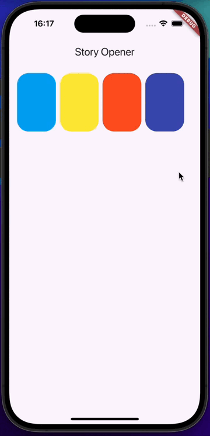

## Story Opener
Package provides widgets for open/close like stories with TweenSequence animation:


## Usage
1) Create StoryOpenerController - it remembers which cards are wrapped for further animation of the transition from the open state to the closed one.
```dart
final StoryOpenerController controller = StoryOpenerController();
```

2) Create a list of widgets from which the opening will occur and pass the initial index for the first opening and the necessary parameters of the closed and open states:
```dart
StoryOpener(
    index: index,
    controller: controller,
    closedBuilder: (
        BuildContext context,
        void Function() openStory,
    ) =>
        GestureDetector(
            onTap: openStory,
            child: StoryCard(),
        ),
    openBuilder: (
        BuildContext context,
        void Function(int) closeStory,
    ) =>
        StoryScreen(
            closeStory: closeStory,
        ),
)
```
Internal closures are necessary to initiate the transition.
In the closed state, a closure is passed that accepts an int parameter - this is the currently selected index, to which it will be necessary to go in the opposite direction.

Done.
The logic of the transition inside different stories should be located only inside the widget of the open state and it has nothing to do with the current package for the animation of opening and closing stories.

## Additional information
For more details see example project. And feel free to open an issue if you find any bugs or errors or suggestions.
